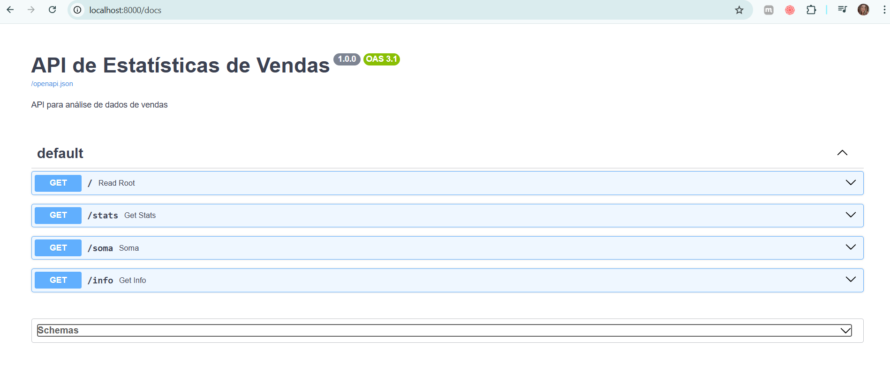
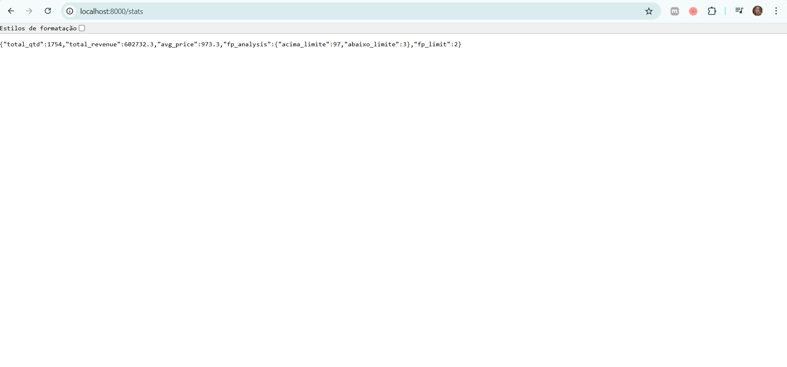
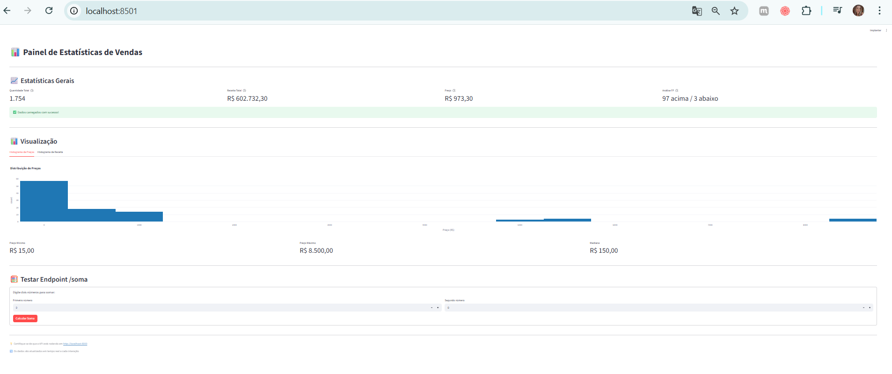

# 📊 Mini-Projeto Integrado em Python

Aplicação completa que integra Pandas, Programação Funcional, FastAPI e Streamlit para análise de dados de vendas.

## 🎯 Funcionalidades

- ✅ Leitura e processamento de dados CSV com Pandas
- ✅ Cálculo de estatísticas (quantidade total, receita total, preço médio)
- ✅ Desafio de Programação Funcional (map/filter/reduce)
- ✅ API REST com FastAPI
- ✅ Dashboard interativo com Streamlit
- ✅ Orientação a Objetos (POO) com classes DataLoader e StatsService

## 📁 Estrutura do Projeto
```
PythonProject1/
├── data/
│   └── dados.csv              # Dataset de vendas
├── src/
│   ├── core/
│   │   ├── __init__.py
│   │   ├── metrics.py         # Função 'analisar' (FP)
│   │   └── models.py          # Classes POO (DataLoader, StatsService)
│   ├── __init__.py
│   └── make_stats.py          # Script para gerar stats.json
├── app.py                     # API FastAPI
├── streamlit_app.py           # Dashboard Streamlit
├── stats.json                 # Estatísticas geradas
├── requirements.txt           # Dependências
└── README.md                  # Este arquivo
```

## 🚀 Como Instalar

1. **Clone o repositório:**
```bash
git clone https://github.com/SEU_USUARIO/SEU_REPOSITORIO.git
cd SEU_REPOSITORIO
```

2. **Crie um ambiente virtual:**
```bash
python -m venv .venv
```

3. **Ative o ambiente virtual:**

**Windows:**
```bash
.venv\Scripts\activate
```

**Linux/Mac:**
```bash
source .venv/bin/activate
```

4. **Instale as dependências:**
```bash
pip install -r requirements.txt
```

## 📊 Como Gerar Estatísticas

Execute o script para processar os dados e gerar o arquivo `stats.json`:
```bash
python src/make_stats.py
```

Ou (se estiver usando outro nome):
```bash
python main.py
```

## 🌐 Como Subir a API

Inicie o servidor FastAPI:
```bash
uvicorn app:app --reload
```

A API estará disponível em: `http://localhost:8000`

### Endpoints disponíveis:

- `GET /` - Informações da API
- `GET /stats` - Retorna as estatísticas calculadas
- `GET /soma?a=5&b=10` - Soma dois números
- `GET /docs` - Documentação interativa (Swagger)

## 🎨 Como Rodar o Streamlit

**Em um segundo terminal**, execute:
```bash
streamlit run streamlit_app.py
```

O dashboard abrirá automaticamente em: `http://localhost:8501`

## 📸 Screenshots

### API - Documentação Swagger


### API - Endpoint /stats


### Dashboard Streamlit


## 🧪 Funcionalidades Implementadas

### 1. Estatísticas com Pandas
- Quantidade total de itens vendidos
- Receita total
- Preço médio dos produtos

### 2. Desafio de Programação Funcional
Implementação usando apenas `map`, `filter` e `reduce` (sem loops):
- Filtra valores acima do limite
- Análise de dados da coluna especificada

### 3. API REST com FastAPI
- `/health` - Status da API
- `/stats` - Estatísticas completas
- `/soma` - Calculadora simples

### 4. Classes POO
- **DataLoader**: Carrega e valida o CSV
- **StatsService**: Calcula estatísticas

### 5. Dashboard Streamlit
- Exibe métricas em tempo real
- Histogramas interativos
- Formulário para testar endpoints da API

## 👨‍💻 Autor

Rodrigo Balmant
- Disciplina: Linguagem Python
- Professor: Raphael Maurício Sanches de Jesus
- Instituição: Estácio

## 📝 Licença

Este projeto foi desenvolvido para fins educacionais.
